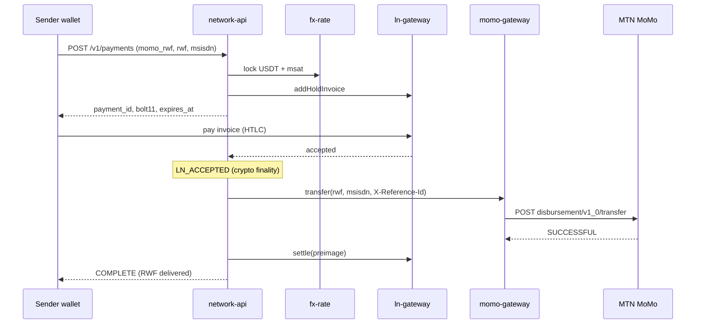

# Offramp flow: Lightning → RWF MoMo

MoMo is one rail on the LN payment network. Canonical path for `rail: momo_rwf`.

## Sequence



## Request / response

```json
{
  "rail": "momo_rwf",
  "amount_rwf": 1350,
  "msisdn": "250788123456"
}
```

```json
{
  "payment_id": "pay_...",
  "rail": "momo_rwf",
  "status": "INVOICE_ISSUED",
  "bolt11": "lnmem1...",
  "amount_msat": "1068422",
  "amount_usdt_micros": "1000000",
  "amount_rwf": "1350",
  "fee_bps": "150",
  "expires_at": "2026-08-11T08:02:00.000Z"
}
```

Ledger rail (stable balance, no MoMo):

```json
{
  "rail": "ledger",
  "amount_usdt_micros": "2000000",
  "account_id": "acc_demo"
}
```

## Statuses

`INVOICE_ISSUED` · `LN_ACCEPTED` · `DISBURSING` · `COMPLETE` · `REFUNDED` · `MANUAL_REVIEW` · `EXPIRED`

## Failure paths

1. Quote expired before pay → `EXPIRED`, cancel hold, no MoMo.
2. MoMo float or inbound LN too low → `503`, no invoice.
3. MoMo FAILED → cancel hold → `REFUNDED`.
4. MoMo PENDING/unknown → `MANUAL_REVIEW`, do not settle, do not mint a second reference.
5. Duplicate accept → one transfer (`X-Reference-Id` + status guard).

## UX stages

1. Waiting for Lightning
2. Bitcoin received
3. Sending to Mobile Money
4. RWF delivered
