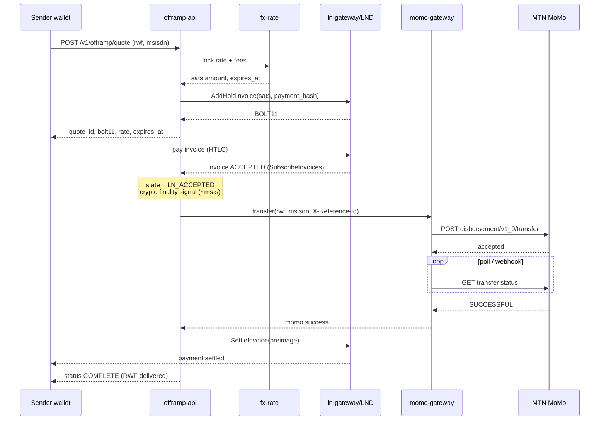

# Offramp flow: Lightning BTC → RWF MoMo

Canonical happy path and failure paths for agents implementing NikoPay Lightning.

## Actors

- **Sender**: Pays BOLT11 from any LN wallet (Phoenix, Zeus, etc.)
- **NikoPay offramp-api**: Quotes, orchestrates, tracks
- **LND**: Receives payment (hold invoice)
- **MTN MoMo**: Credits recipient MSISDN in RWF
- **Recipient**: Mobile Money user in Rwanda

## Sequence (hold invoice: recommended)



## Why hold invoices

| Mode | Behavior | Risk |
|------|----------|------|
| **Normal invoice** | Settles LN immediately on payment | If MoMo fails, NikoPay owes RWF or must manually refund BTC |
| **Hold invoice** | Accept HTLC → disburse → settle only on MoMo success | MoMo/API outage → timeout refunds sats automatically |

For ~1s *crypto* finality with safer *fiat* coupling, use **hold invoices** with HTLC expiry ≥ MoMo worst-case latency (often ≥ 60s; tune with ops data).

## Quote request / response (shape)

```json
// POST /v1/offramp/quote
{
  "amount_rwf": 50000,
  "destination": { "type": "mtn_momo", "msisdn": "250788123456" },
  "webhook_url": "https://optional.example/hook"
}
```

```json
{
  "offramp_id": "np_ln_01HXYZ...",
  "bolt11": "lnbc...",
  "amount_msat": "4123456000",
  "rate": { "btc_rwf": 95000000, "fee_rwf": 750, "fee_bps": 150 },
  "expires_at": "2026-07-30T14:02:00Z",
  "status": "INVOICE_ISSUED"
}
```

## Status values

Use exactly these in code and APIs (see `packages/shared`):

`CREATED` · `QUOTED` · `INVOICE_ISSUED` · `LN_ACCEPTED` · `DISBURSING` · `MOMO_SUCCESS` · `LN_SETTLED` · `COMPLETE` · `MOMO_FAILED` · `LN_CANCELED` · `REFUNDED` · `MOMO_UNKNOWN` · `MANUAL_REVIEW` · `EXPIRED`

## Failure paths

1. **Quote expired before pay** → reject payment / let invoice expire; no MoMo call.
2. **Insufficient MoMo float at quote time** → `503` / business error; do not issue invoice.
3. **Insufficient inbound LN liquidity** → same; do not issue invoice.
4. **LN never pays** → invoice expires; terminal `EXPIRED`.
5. **MoMo FAILED after LN_ACCEPTED** → `CancelInvoice`; state `REFUNDED`.
6. **MoMo status stuck** → retries with backoff → `MANUAL_REVIEW` (ops); **do not** settle LN until confirmed success; **do not** re-transfer without idempotent key reuse check.

## Idempotency rules

- `offramp_id` primary key
- MoMo `X-Reference-Id` = UUIDv5(namespace, offramp_id): same id on every retry
- Settle/cancel LN at most once; gate on DB state transitions (conditional updates)

## UX stages (product)

1. **Waiting for Lightning**: show QR / BOLT11  
2. **Bitcoin received**: LN accepted (crypto finality)  
3. **Sending to Mobile Money**: disbursing  
4. **RWF delivered**: COMPLETE + receipt  

Do not claim “instant RWF” if MoMo is still pending; claim **instant Bitcoin settlement** + **fast MoMo payout**.

## Test checklist

- [ ] Simnet/regtest: pay hold invoice → mock MoMo success → settle
- [ ] Mock MoMo fail → cancel → sender balance restored
- [ ] Double webhook / double poll does not double-pay
- [ ] Quote TTL enforced
- [ ] Low float blocks quotes
